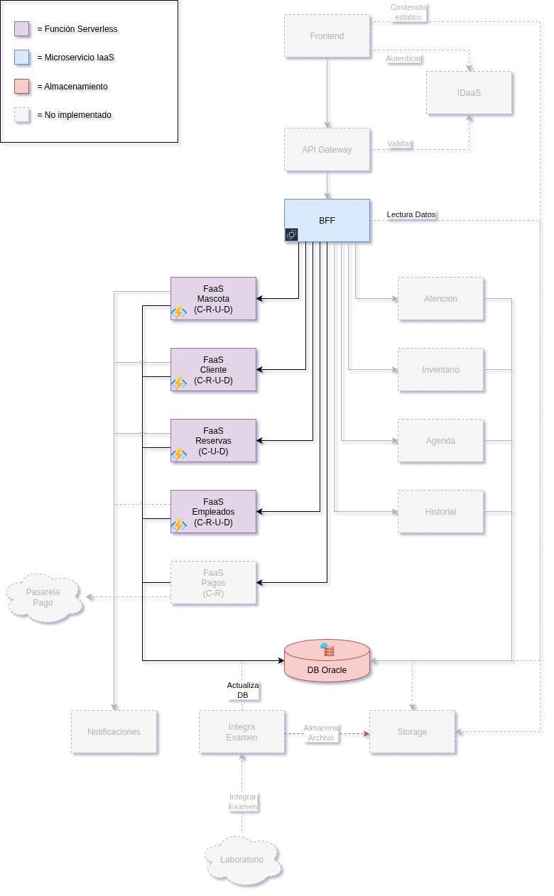

# 🐾 Sistema de Gestión Veterinaria

## 📌 Descripción

Este proyecto corresponde a una solicitud académica de parte de Duoc UC, para la asignatura de **Desarrollo Cloud Native II**. No es un proyecto real, sino que simula la creación de un sistema informático cloud para una veterinaria. 

El objetivo final es crear un sistema informático cloud para una veterinaria que maneje la información de:

- Clientes
- Mascotas
- Inventario de medicamentos e insumos clínicos
- Citas y agenda de consultas
- Empleados
- Historial clínico
- Facturación y pagos
- Comunicación con clientes
- Integración con laboratorios externos

---

**“Implementando un sistema con arquitectura Serverless”**.

Se diseñó e implementó un **sistema backend para la gestión de una clínica veterinaria**, utilizando un enfoque **serverless e híbrido (REST + GraphQL)**, compuesto por:

- **Microservicio BFF** (Spring Boot en Java, Docker).
- Funciones **Serverless en Azure Functions (Java)**:
  - `ClientesFn` → CRUD de clientes.
  - `MascotasFn` → CRUD de mascotas.
- **Módulo GraphQL**: consultas flexibles de clientes y mascotas.
- **Oracle Autonomous DB** (conexión vía Wallet).

---

## 🏗️ Arquitectura

### Diagrama

**Componentes actuales:**
- **BFF (Spring Boot):** expone endpoints REST y GraphQL; orquesta llamadas a funciones.
- **ClientesFn:** gestiona operaciones CRUD de clientes.
- **MascotasFn:** gestiona operaciones CRUD de mascotas y relaciones con especies/razas.
- **GraphQL Provider:** permite consultas flexibles (ej: cliente con todas sus mascotas, mascotas con detalles de especie/raza).
- **Oracle DB:** Base de Datos Oracle Cloud.

---

## ⚙️ Tecnologías utilizadas

- **Backend Framework:** Spring Boot (Java 21).
- **Funciones Serverless:** Azure Functions en Java.
- **Lenguaje:** Java.
- **Contenedores:** Docker para BFF.
- **Base de Datos:** Oracle Autonomous Database (Wallet).
- **Orquestación de consultas:** GraphQL Java.
- **Control de versiones:** GitHub.

---

## 🚀 Funcionalidades principales (actuales)

### REST (Funciones CRUD)
- **ClientesFn:** alta, baja, modificación y consulta de clientes.
- **MascotasFn:** alta, baja, modificación y consulta de mascotas.

### GraphQL
- **Consultas:**
  - Cliente con todas sus mascotas.
  - Mascota con detalles de especie, raza y estado.

