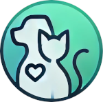
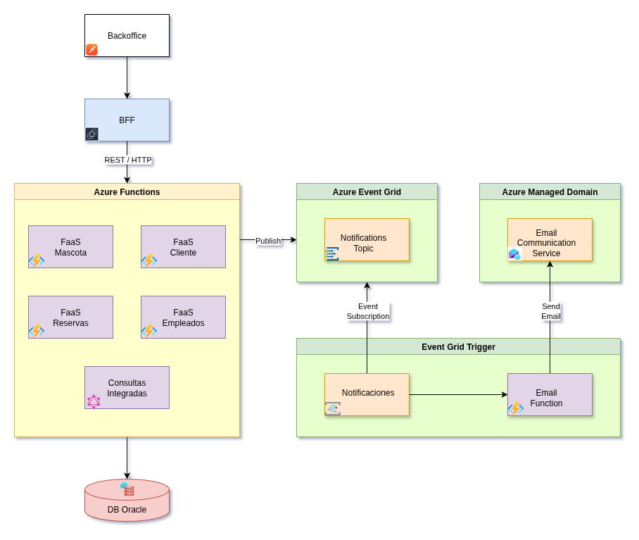

<table>
    <tr>
        <td>
            
        </td>
        <td>
            <h1>VetCare   Sistema de Gestión Veterinaria</h1>
        </td>
    </tr>
</table>

## 📌 Descripción

Este proyecto corresponde a una solicitud académica de **Duoc UC** para la asignatura **Desarrollo Cloud Native II**.
No es un sistema productivo, sino un ejercicio académico que simula la implementación de una **arquitectura cloud nativa basada en funciones serverless**.

El objetivo es crear un **backend serverless** para la gestión de una clínica veterinaria, incorporando:

* Clientes
* Mascotas
* Citas y reservas
* Empleados
* Integración con laboratorio
* Comunicación automática con clientes

---

**“Implementando un sistema con arquitectura Serverless y basada en eventos”**.

Se diseñó e implementó un sistema con:

* **Microservicio BFF** (Spring Boot en Java, Docker).
* **Funciones Serverless (Azure Functions, Java):**
  * `ClienteFunction` → CRUD de clientes.
  * `MascotaFunction` → CRUD de mascotas.
  * `EmpleadoFunction` → CRUD de empleados.
  * `CitaFunction` → Generar reserva de atencion.
  * `GraphQLFunction`→ Consultas flexibles de clientes y mascotas.
  * `NotificacionesFunction` → escucha eventos y dispara notificaciones.
* **Oracle Autonomous DB** para persistencia.
* **Event Grid** para publicación/suscripción de eventos.
* **Azure Communication Services (ACS Email)** para envío de correos personalizados.

---

## 🏗️ Arquitectura

### Diagrama

### Flujo principal

1. El **Backoffice** invoca al **BFF** (REST/GraphQL).
2. El **BFF** llama a las **Azure Functions** (CRUD de clientes, mascotas, citas, empleados).
3. Tras cada operación **C/U/D**, el servicio publica un **evento en Event Grid**.
4. Una **suscripción de Event Grid** activa la `NotificacionesFunction`.
5. La Function procesa el evento y utiliza **ACS Email** para enviar un correo al cliente.

---

## ⚙️ Tecnologías utilizadas

* **Lenguaje:** Java 21
* **Backend Framework:** Spring Boot (BFF)
* **Funciones Serverless:** Azure Functions (v4, Java)
* **Base de Datos:** Oracle Autonomous Database (Wallet)
* **Eventos:** Azure Event Grid
* **Notificaciones:** Azure Communication Services (Email)
* **Orquestación de consultas:** GraphQL Java
* **Contenedores:** Docker
* **Control de versiones:** GitHub

---

## 🚀 Funcionalidades actuales

### REST (Funciones CRUD)

* `ClienteFunction`: gestión de clientes.
* `MascotaFunction`: gestión de mascotas.
* `EmpleadoFunction`: gestión de empleados.
* `CitaFunction`: gestión de citas.

### GraphQL

Consultas integradas:

* Cliente con todas sus mascotas.
* Mascota con detalles de especie, raza y cliente asociado.

### Event-Driven

* Publicación de eventos:
  * `com.veterinaria.mascota.created|updated|deleted`
  * `com.veterinaria.cliente.created|updated|deleted`
* `NotificacionesFunction`: escucha eventos y dispara notificaciones.

### Notificaciones

* **Email al cliente** al registrar/actualizar/eliminar mascota o cliente.
* Plantillas **HTML + TXT** almacenadas en `/resources/templates`.
* Personalización con nombre de cliente, nombre de mascota y branding de **VetCare**.

